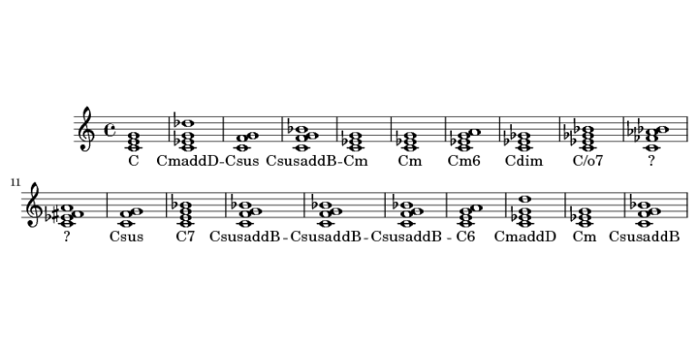

<!-- README.md is generated from README.Rmd. Please edit that file -->
chordgen
========

The goal of chordgen is to generate random chords using R

Installation
------------

You can install chordgen from github with:

``` r
# install.packages("devtools")
devtools::install_github("jtrecenti/chordgen")
```

Example
-------

This is a basic example:

``` r
library(chordgen)
#> Loading required package: music21
chordgen(20, 
         n_notes = 3:4, 
         octave = 0, 
         transpose = 0, 
         triad_types = 1:5,
         invert = FALSE,
         add_lyric = TRUE) %>% 
  plot()
```



Shiny app
---------

Check out the shiny app

``` r
app <- system.file("chordgen/app.R", package = "chordgen")
shiny::runApp(app)
```

Or run directly from github (after installing `chordgen`, of course)

``` r
shiny::runGitHub("chordgen", "jtrecenti", subdir="inst/chordgen/")
```
